<p align="center">
  
</p>

# Introduction

- 머신러닝 개발자를 위한 시각화 및 hyperparameter optimizing service
- 개발기간 : 2020.06 ~ 2020.11 (약 6개월)
- [Front-end Github](https://github.com/NutellaCoder/NutellaCoder-WebFrontEnd)
- [Back-end Github](https://github.com/NutellaCoder/WebApiServer)
- [SDK-Github](https://github.com/NutellaCoder/NutellaSdk)

<!-- # Demo

[](https://youtu.be/x_OftNpGTy0)

<!--
# Model

 -->

# Installation

```
npm install
npm start
```

or

```
yarn init
yarn start
```

# Service Description

## Login

<p align="center">
  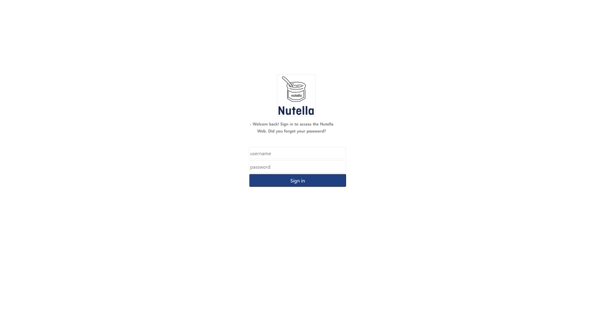
</p>

## ML Performance Visualization

<p align="center">
  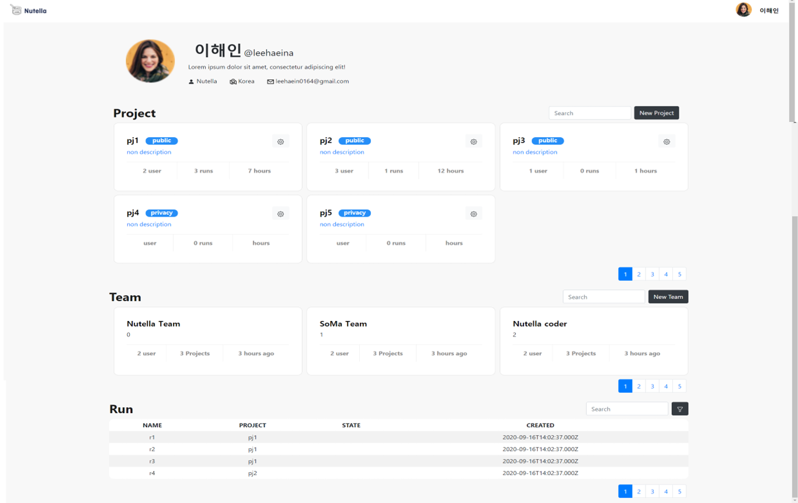
</p>

### Step 1. Create Project

- Push the New Project Button for create new project
<p align="center">
  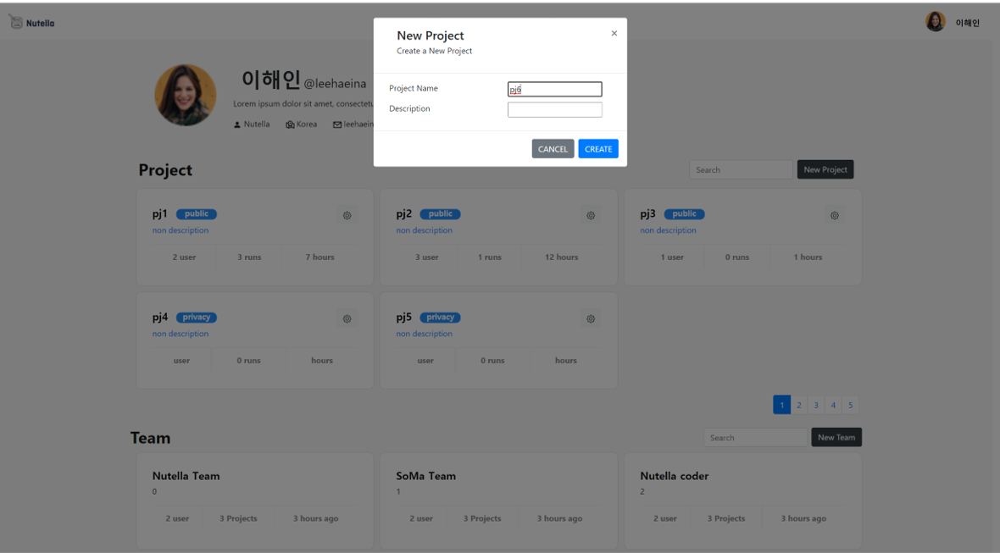
</p>

- Create Project Api Key
- You can input this Api key in your package
<p align="center">
  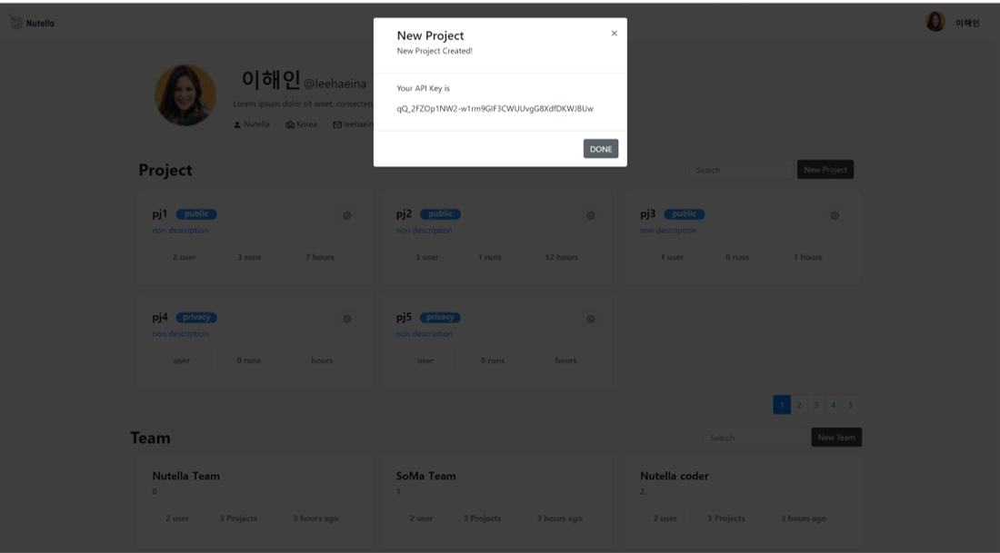
</p>

- And then, You can check your new project in the list
<p align="center">
  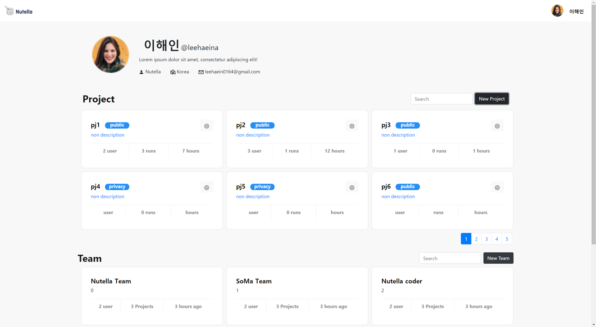
</p>

### Step 2. Fit the Model

### Step 3. Check ML Performance

- If you select a project, you move on run page
- You can check your models and their performance and system usage
<p align="center">
  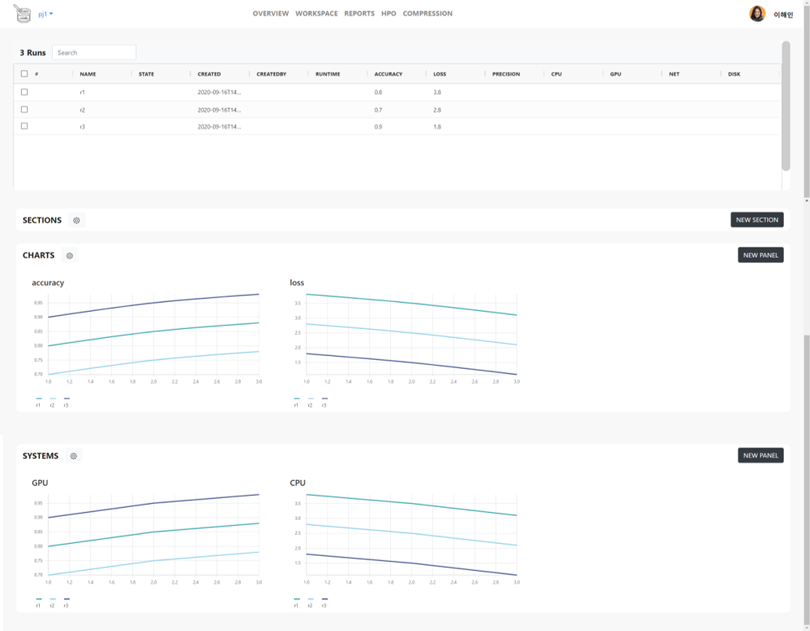
</p>

- Push the "New Chart" Button for create new chart
<p align="center">
  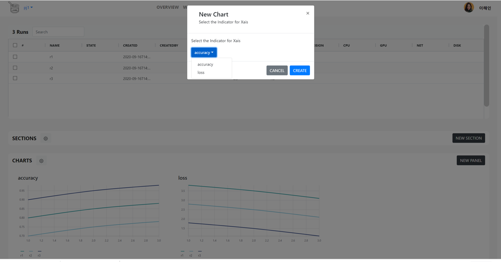
</p>

- You can check new chart
<p align="center">
  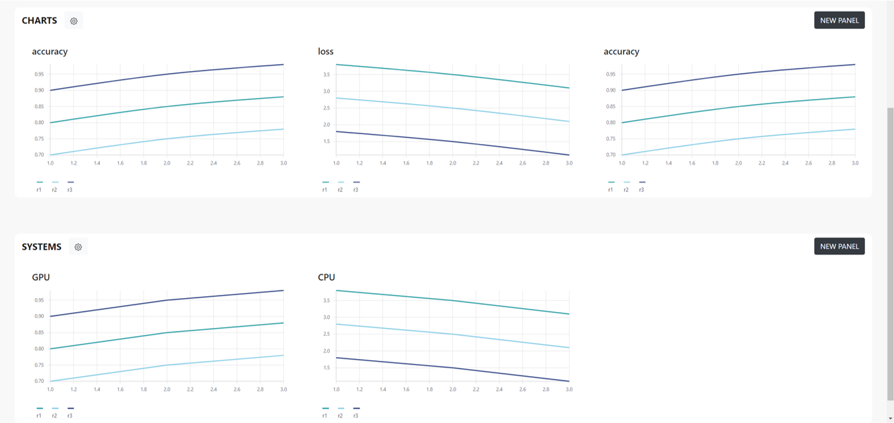
</p>

### Step 4. Check Individual Model Performance

- If you select one model in the top table, you can move on the individual run page
<p align="center">
  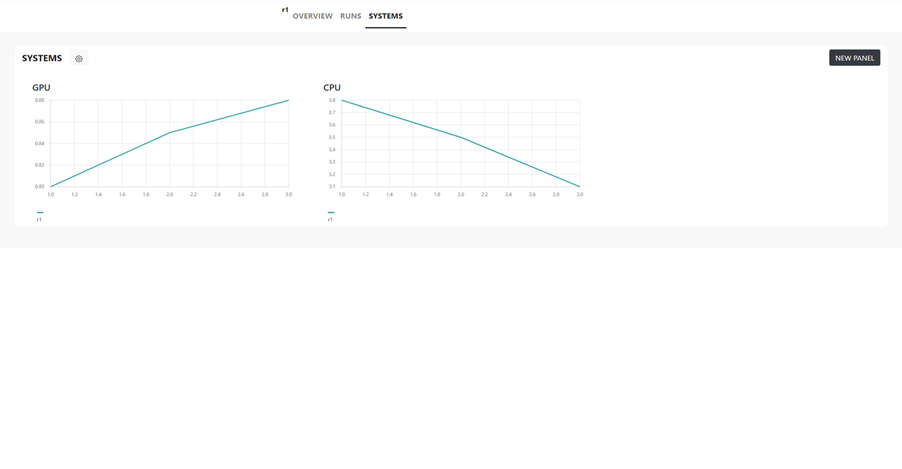
</p>

## Hyperparameter Optimization

<p align="center">
  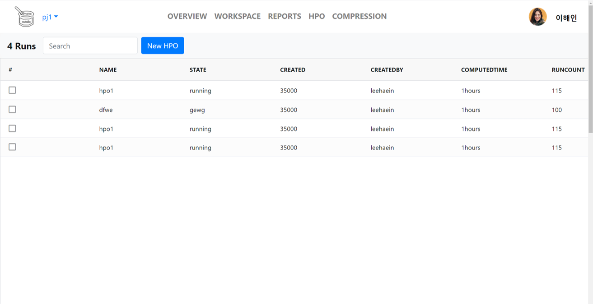
</p>

### Step 1. Create HPO Project

- Push the New Project Button for create new project
- Please enter a name and description.

### Step 2. Set Configuration

- Set config (Method & Hyperparameter)
- ! If you want set config using code, you can select skip button
- Create HPO Api Key
- You can input this Api key in your package
<p align="center">
  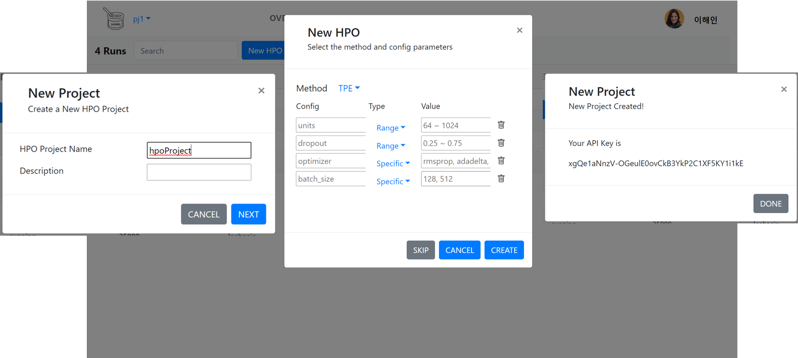
</p>

- And then, You can check your new HPOProject in the list
<p align="center">
  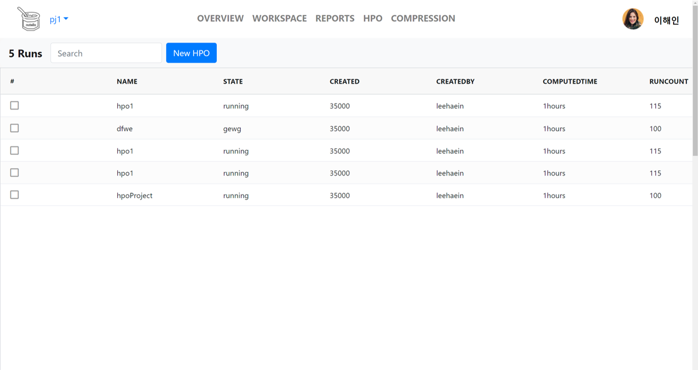
</p>

### Step 3. Fit the Model

### Step 4. Recommend Hyperparmeter

- Please check the results.
<p align="center">
  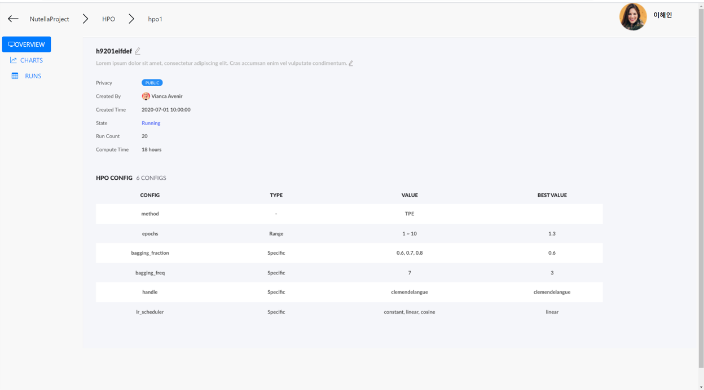
</p>

### Step 5. Check Individual & Total Results

- Nutella recommend Best Hyperparameter
- Best result is shown in red
<p align="center">
  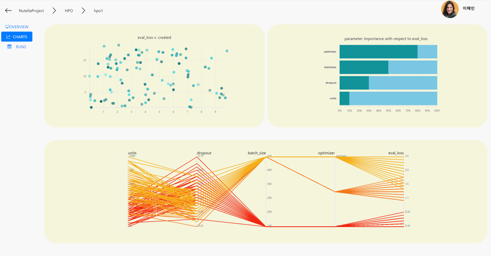
</p>

# Technologies

- React
- Node.js
- MySQL
- Python
- REST API
- REDUX
- CORS headers
- Git, Github
